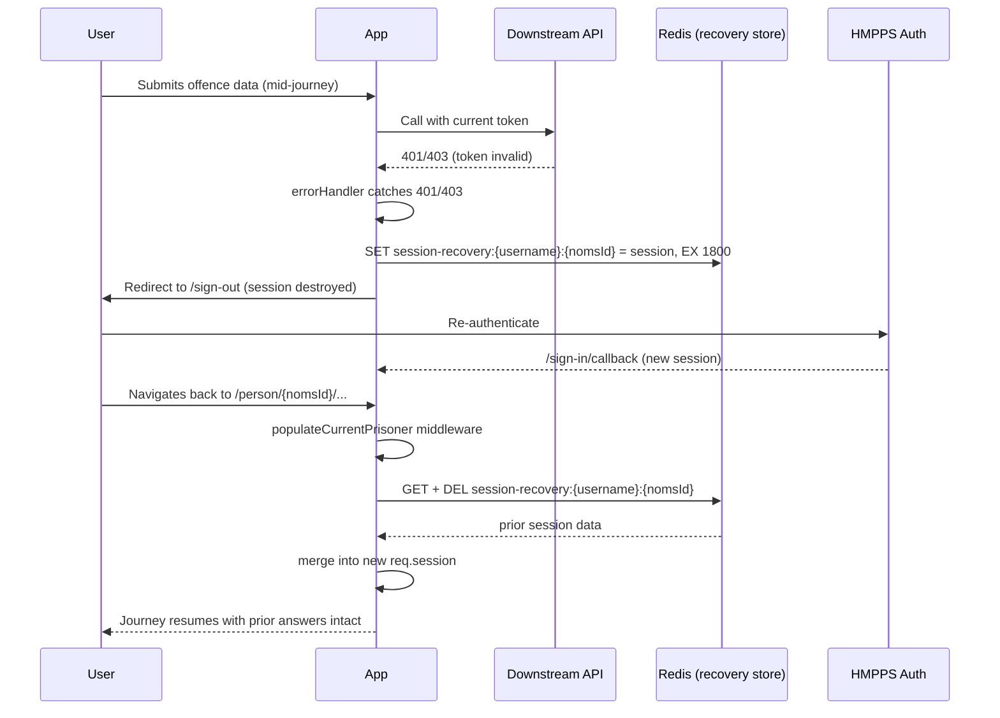

# HLD: Session Recovery on Token Invalidation

## Problem

Users entering a large volume of information into a court hearing (offences, court appearances,
etc.) can hit a 500 error mid-journey. Root cause: when the user's HMPPS auth token is found to be
invalid (a downstream API call returns `401`/`403`), the app logs the user out and **destroys their
Express session** as part of that flow. All in-progress, unsaved journey data held in the session is
lost. The user has to start again, and anecdotally some give up and revert to entering the record
directly in NOMIS instead.

The "multiple counts" feature should reduce how often this is hit (fewer round trips per offence),
but it doesn't eliminate the underlying data-loss risk, so we want to fix session durability directly.

## Where the loss actually happens today

- `server/errorHandler.ts:11-13` — any error with `status === 401 || 403` reaching the global error
  handler redirects to `/sign-out`.
- `server/middleware/setUpAuthentication.ts:63-71` — `/sign-out` calls `req.logout()` then
  `req.session.destroy(...)` before redirecting to the external HMPPS auth sign-out URL. This is the
  destructive step: the session (and everything in it) is gone.
- Re-authenticating afterwards (`/sign-in` → `/sign-in/callback`,
  `setUpAuthentication.ts:51-58`) creates a **brand new** session — there is no continuity with the
  old one, and `returnTo` isn't preserved across a sign-out (it's only set on the token-verification
  redirect path at `setUpAuthentication.ts:81`, not on the errorHandler path).
- Separately, `setUpAuthentication.ts:77-83` (token-verification middleware) redirects to `/sign-in`
  on an invalid/expired token *without* destroying the session — that path is already safe today and
  is out of scope for this change.

So the fix needs to bracket exactly one transition: **session about to be destroyed because of an
auth failure → next time this user is back on a page for the same prisoner, restore what they had.**

## Proposed solution

Use Redis (already the session store backing this app — `server/middleware/setUpWebSession.ts:12-15`
via `connect-redis`) as a short-lived side channel, independent of the session store itself, keyed by
**`username` + `nomsId` (prisoner ID)**.

1. **Snapshot on invalidation** — in `errorHandler.ts`, on the `401`/`403` branch, before redirecting
   to `/sign-out`, write the *entire* current `req.session` to Redis under a key derived from
   `res.locals.user.username` and `req.params.nomsId`. TTL: 30 minutes.
2. **Restore on return** — in `server/middleware/populateCurrentPrisoner.ts`, which already runs on
   every request under `/person/:nomsId` and already has both `res.locals.user.username` and
   `req.params.nomsId` available together, check Redis for a matching entry. If found, merge/overwrite
   it into the (new) `req.session`, then delete the Redis entry immediately so it's a one-time
   recovery, not a sticky cache.

This reuses the exact pair of identifiers the business already asked for, needs no new cookies or
query-string plumbing, and piggybacks on a middleware that already does one network round trip per
request (`prisonerSearchService.getPrisonerDetails`), so an extra Redis `GET` is negligible.

### Why "whole session" rather than a hand-picked slice

The session shape already has several independent journey containers (`courtAppearances`,
`offences`, `unknownRecallSentenceUuids`, `aggravatingChargeUuids`, `outcomeUpdateChargeUuids` —
`server/@types/express/index.d.ts:7-16`), and new features keep adding more (aggravating factors,
document upload are both in flight). Snapshotting `req.session` wholesale means recovery doesn't need
updating every time a new journey field is added — it stays correct by construction. The cost is
restoring slightly more than the single prisoner's data if the user had more than one journey
mid-flight, which is an acceptable trade-off given today's usage pattern (one prisoner record at a
time, in one tab).

## New component: `server/data/sessionRecoveryStore.ts`

Modelled directly on the existing `server/cache/refDataCache.ts` pattern (own `createRedisClient()`
instance, guarded by `config.redis.enabled`, JSON stringify/parse, TTL via `EX`, swallow-and-log on
Redis errors so a Redis blip never breaks the sign-out/sign-in flow itself):

```ts
const getKey = (username: string, nomsId: string) => `session-recovery:${username}:${nomsId}`

export async function saveSession(username: string, nomsId: string, session: SessionData): Promise<void>
export async function restoreAndClearSession(username: string, nomsId: string): Promise<Partial<SessionData> | null>
```

- `saveSession` — `SET session-recovery:<username>:<nomsId> <json> EX 1800`.
- `restoreAndClearSession` — `GET` then `DEL` (or a single `GETDEL` if the Redis version in use
  supports it — needs a version check against the ElastiCache/Redis version this app targets before
  relying on it; `GET` + `DEL` is the safe fallback).
- Both are no-ops (return immediately) when `config.redis.enabled` is `false`, matching
  `refDataCache.ts`'s behaviour, so local dev without Redis is unaffected.

## Trigger points (exact)

| Step | File | Hook |
|---|---|---|
| Snapshot | `server/errorHandler.ts:11-13` | Before `res.redirect('/sign-out')`, if `res.locals.user?.username` and `req.params?.nomsId` are both present, `await saveSession(username, nomsId, req.session)`. Wrap in try/catch — a Redis failure must not block the existing sign-out redirect. |
| Restore | `server/middleware/populateCurrentPrisoner.ts:13-19` | After the existing `canAccessPrisoner` check succeeds (so we don't restore data for a prisoner the user can no longer access), `await restoreAndClearSession(user.username, nomsId)`; if non-null, assign the recovered fields onto `req.session`. |

Both files already sit exactly where `username` and `nomsId` are naturally in scope — no new
middleware needs to be threaded into the route tree.

## Sequence



## Edge cases

- **Voluntary sign-out must NOT be recoverable.** If a user deliberately clicks "Sign out"
  (`server/views/partials/header.njk:39` → `GET /sign-out` → `setUpAuthentication.ts:63-71`), that
  route destroys the session directly and never passes through `errorHandler.ts`. The snapshot hook
  lives *only* in the `401`/`403` branch of `errorHandler.ts`, not in the `/sign-out` route itself —
  so a deliberate logout takes no snapshot and progress is correctly discarded, exactly as it
  behaves today. Recovery only ever triggers on the involuntary path: a downstream API call failing
  with `401`/`403` because the token has expired/been invalidated (e.g. the ~2 hour token lifetime),
  which is caught by `errorHandler.ts` and *then* redirects to `/sign-out`. This distinction is
  load-bearing — the two paths must stay separate; do not move the snapshot call into the shared
  `/sign-out` handler, or a deliberate logout would start being "recovered" too.
- **No `nomsId` in scope** (error occurs on a route not under `/person/:nomsId`) — skip the snapshot;
  behaviour is unchanged from today (session still destroyed, no recovery possible, same as now).
- **User never comes back** — TTL of 30 minutes means the Redis entry self-expires; no manual cleanup
  needed, matches the agreed requirement.
- **User comes back as a different user for the same prisoner, or same user for a different prisoner**
  — key is `username + nomsId`, so neither cross-contaminates the other.
- **Redis unavailable** — both `saveSession` and `restoreAndClearSession` fail soft (log and continue);
  worst case is today's existing behaviour (data loss), not a new failure mode.
- **User re-enters the same prisoner's journey in a second tab before recovery** — restore overwrites
  `req.session` on the *new* session for that browser only; the old snapshot is deleted on first read,
  so it can't be double-applied.

## Config / rollout

- No new config keys — reuses `config.redis.*` (`REDIS_ENABLED`, `REDIS_HOST`, `REDIS_PORT`,
  `REDIS_AUTH_TOKEN`, `REDIS_TLS_ENABLED`) already used by the session store and `refDataCache.ts`.
- TTL (1800s / 30 min) is defined as a constant in `sessionRecoveryStore.ts` per the agreed
  requirement; not exposed as an env var unless we later want it tunable per environment.

## Testing

- Unit tests for `sessionRecoveryStore.ts` (save/restore/expiry) following the existing pattern in
  the test suite for `refDataCache.ts`.
- `errorHandler.ts` test: 401/403 with `nomsId` present triggers a save call before the redirect;
  without `nomsId`, no save call is made and behaviour is unchanged.
- `populateCurrentPrisoner.ts` test: Redis hit restores and clears session fields; Redis miss leaves
  session untouched; restore is skipped when `canAccessPrisoner` fails.
- Manual/integration: reproduce a 401 mid-journey (e.g. via a test double that forces a downstream
  401), confirm sign-out → sign-in → return to the same prisoner restores previously entered answers.

## Out of scope for this change

- **Recalls** — the equivalent fix needs to be made in the Recalls service's own repository (separate
  codebase, not present in this workspace). The design above (Redis key = `username` + `nomsId`, TTL
  30 min, snapshot-on-401/403, restore-on-next-prisoner-scoped-request) should port directly if that
  service has an equivalent session/auth-failure shape, but the exact file/line hooks will differ and
  need to be located in that repo.
- Auto-redirecting the user straight back to the exact page they were on after re-login (today they
  land on the app home page after sign-out/sign-in). Restoring the *data* is in scope; restoring the
  *URL* is a separate, smaller UX improvement that could piggyback on `returnTo` handling if wanted
  later.
